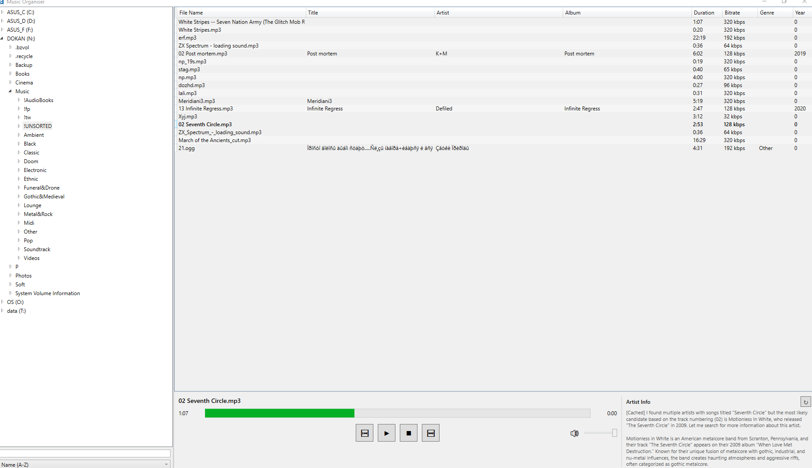

# Music Organiser

A Windows desktop application for managing and playing music files, built with C# WPF and .NET 8.

## Features

### File Browser
- Tree view of all drives (local, network, USB, CD/DVD)
- Async folder loading for responsive UI
- Filter folders by name
- Sort folders by Name, Creation Date, or Modified Date (ascending/descending)

### Music Library
- Grid view of music files in the selected folder
- Displays metadata: file name, title, artist, album, duration, bitrate, genre, year
- Highlights currently playing track
- Supported formats: MP3, FLAC, WAV, WMA, AAC, OGG, M4A

### Audio Player
- Play/Pause/Stop controls
- Previous/Next track navigation
- Click-to-seek progress bar
- Volume control
- Auto-play next track when current track ends

### File Operations
- Copy/Move/Delete files and folders
- Recent folders menu (last 10 destinations for Copy and Move separately)
- Confirmation dialog for delete operations
- Automatically stops playback before moving/deleting playing files

## Screenshots



## Requirements

- Windows 10 or later
- .NET 8.0 Runtime

## Installation

### Option 1: Build from source
```bash
git clone https://github.com/yourusername/musicorganiser.git
cd musicorganiser
dotnet build -c Release
```

### Option 2: Download release
Download the latest release from the [Releases](https://github.com/yourusername/musicorganiser/releases) page.

## Usage

```bash
dotnet run --project MusicOrganiser
```

Or run the compiled executable directly.

### Keyboard Shortcuts
- **Double-click** on a track to play it
- **Right-click** on folders or files for context menu (Copy/Move/Delete)

## Building

```bash
# Debug build
dotnet build

# Release build
dotnet build -c Release

# Publish as single-file executable
dotnet publish -c Release -r win-x64 --self-contained -p:PublishSingleFile=true
```

## Project Structure

```
MusicOrganiser/
├── Models/           # Data models
├── Services/         # Audio player, file operations, metadata
├── ViewModels/       # MVVM view models
├── Converters/       # WPF value converters
├── MainWindow.xaml   # Main UI
└── App.xaml          # Application entry
```

## Dependencies

- [NAudio](https://github.com/naudio/NAudio) - Audio playback
- [TagLibSharp](https://github.com/mono/taglib-sharp) - Audio metadata reading

## License

MIT License - see [LICENSE](LICENSE) for details.
