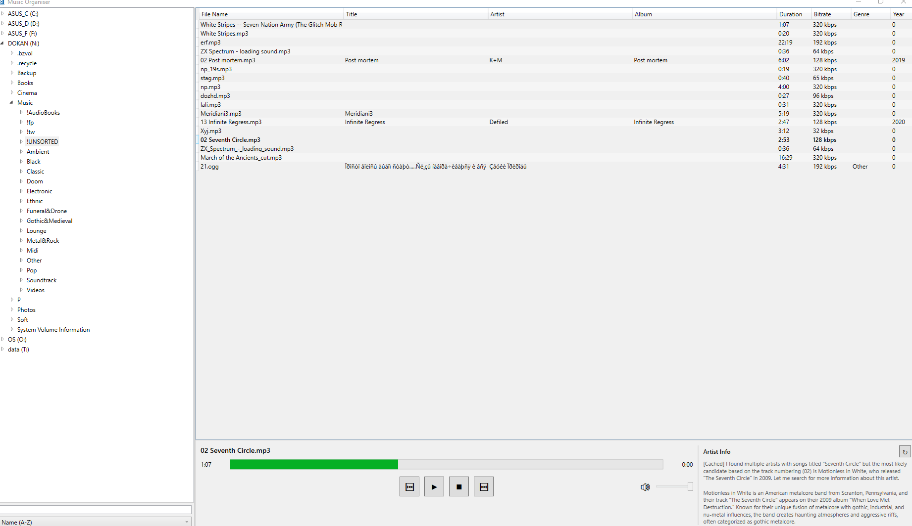

# Music Organiser

A Windows desktop application for managing and playing music files, built with C# WPF and .NET 8.

## Features

### File Browser
- Tree view of all drives (local, network, USB, CD/DVD)
- Async folder loading for responsive UI
- Filter folders by name
- Sort folders by Name, Creation Date, or Modified Date (ascending/descending)

### Music Library
- Grid view of music files in the selected folder
- Displays metadata: file name, title, artist, album, duration, bitrate, genre, year
- Highlights currently playing track
- Supported formats: MP3, FLAC, WAV, WMA, AAC, OGG, M4A
- Album cover displayed behind the file grid

### Ratings & Tags
- 1–5 star rating for both tracks and folders
- Free-form comma-separated tags for both tracks and folders
- Filled stars and existing tags show inline; hover a row to reveal the editable stars/tag box
- Ratings and tags are stored in the local cache and survive folder rescans

### Local Cache (SQLite)
- Files and folders are cached in a local SQLite database (WAL mode) at `%APPDATA%\MusicOrganiser\cache.db`
- First visit reads the filesystem and tags; later visits serve instantly from the cache
- Cache-first display with an in-app background refresh that re-scans and live-updates the grid/tree when files change on disk
- Unchanged files are served from cache without re-parsing tags

### Audio Player
- Play/Pause/Stop controls
- Previous/Next track navigation
- Click-to-seek progress bar
- Volume control
- Auto-play next track when current track ends

### AI Artist Info Panel
- AI-powered artist summaries using Claude with web search
- Automatically identifies artists from tags, song titles, and filenames
- Persistent caching of artist info for faster loading
- Refresh button to re-fetch artist information
- Requires Anthropic API key

### File Operations
- Copy/Move/Delete files and folders
- Recent folders menu (last 10 destinations for Copy and Move separately)
- Confirmation dialog for delete operations
- Automatically stops playback before moving/deleting playing files

## Screenshots



## Requirements

- Windows 10 or later
- .NET 8.0 Runtime

## Installation

### Option 1: Build from source
```bash
git clone https://github.com/yourusername/musicorganiser.git
cd musicorganiser
dotnet build -c Release
```

### Option 2: Download release
Download the latest release from the [Releases](https://github.com/yourusername/musicorganiser/releases) page.

## Usage

```bash
dotnet run --project MusicOrganiser
```

Or run the compiled executable directly.

### AI Artist Info Setup (Optional)

The app displays AI-generated artist summaries using Claude Haiku 4.5 with web search. To enable:

1. Get an API key from [Anthropic Console](https://console.anthropic.com/)
2. Create a `.env` file in the project root directory:
   ```
   ANTHROPIC_API_KEY=your-api-key-here
   ```
3. The artist info panel appears on the right side of the player

**How it works:**
- Uses web search to find real-time information about artists
- Identifies artists from ID3 tags, song titles, album names, and filenames
- Caches confident results locally for faster subsequent lookups
- Click the refresh button (↻) to re-fetch artist info

**Note:** Web search costs $10 per 1,000 searches in addition to token costs.

### Keyboard Shortcuts
- **Double-click** on a track to play it
- **Right-click** on folders or files for context menu (Copy/Move/Delete)

## Building

```bash
# Debug build
dotnet build

# Release build
dotnet build -c Release

# Publish as single-file executable
dotnet publish -c Release -r win-x64 --self-contained -p:PublishSingleFile=true
```

## Project Structure

```
MusicOrganiser/
├── Models/           # Data models (MusicFile, FolderRecord, caches, settings)
├── Services/         # Audio player, file operations, metadata, SQLite cache
├── ViewModels/       # MVVM view models
├── Converters/       # WPF value converters
├── Controls/         # Reusable controls (StarRating)
├── MainWindow.xaml   # Main UI
└── App.xaml          # Application entry
```

## Dependencies

- [NAudio](https://github.com/naudio/NAudio) - Audio playback
- [TagLibSharp](https://github.com/mono/taglib-sharp) - Audio metadata reading
- [Microsoft.Data.Sqlite](https://learn.microsoft.com/dotnet/standard/data/sqlite/) - Local SQLite cache for files and folders
- [Anthropic.SDK](https://github.com/tghamm/Anthropic.SDK) - Claude AI integration for artist summaries
- [DotNetEnv](https://github.com/tonerdo/dotnet-env) - Environment variable loading from .env files

## License

MIT License - see [LICENSE](LICENSE) for details.
